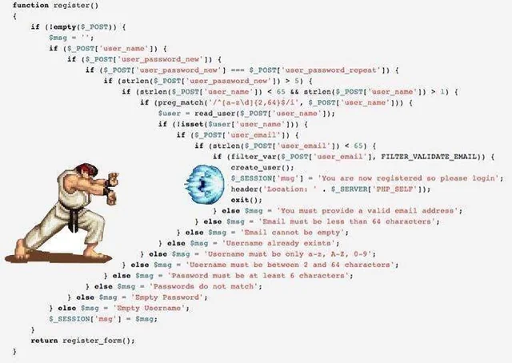

## Sumário

### Parte 1
- [Introdução ao Java](#introdução-ao-java)
- [Estrutura Básica de um Programa Java](#estrutura-básica-de-um-programa-java)
- [Plataforma Java](#plataforma-java)
- [Conceitos de Orientação a Objetos](#conceitos-de-orientação-a-objetos)
  - [Objeto](#objeto)
  - [Classe](#classe)
  - [Abstração, Encapsulamento e Polimorfismo](#abstração-encapsulamento-e-polimorfismo)
- [Exemplo Prático](#exemplo-prático)
- [Resumo de Conceitos](#resumo-de-conceitos)
- [Mão na massa](https://github.com/Macelot/java-lista01)
- [Exemplo básicão](https://github.com/Macelot/java-sistema-menu/)

### Parte 2
- [Comparator e Comparable em Java](#comparator-e-comparable-em-java)
- [Boas Práticas](#boas-práticas)
- [Evite Código "Hadouken"](#evite-código-hadouken)
- [Comentários Apenas Quando Necessário](#comentários-apenas-quando-necessário)
- [Leitura e Escrita de Arquivos em Java](#leitura-e-escrita-de-arquivos-em-java)
  
---
Com essa organização, não será necessário renumerar os itens quando adicionar ou remover tópicos. O uso de títulos com `##` e `###` no corpo do documento continua funcionando normalmente com os links internos (âncoras).

Se desejar, posso revisar os títulos internos também para garantir que os links estejam 100% funcionais de acordo com a nova estrutura. Deseja que eu revise isso também?


<p align="center">
  
</p>

## 1. Introdução ao Java
O Java é uma linguagem de programação que opera na Java Virtual Machine (JVM), que converte bytecode em instruções compreensíveis pelo sistema operacional. O conceito "Write Once, Run Anywhere" permite que programas Java sejam escritos uma única vez e executados em diferentes plataformas, garantindo portabilidade.

## 2. Estrutura Básica de um Programa Java
Um programa em Java é formado por classes e métodos, sendo as classes a principal unidade de encapsulamento. Elas podem conter variáveis de instância e métodos que definem o comportamento dos objetos criados.

## 3. Plataforma Java
O Java é suportado por um compilador e uma máquina virtual que funcionam em diversos sistemas operacionais.

| Tecnologia | Descrição |
|------------|---------------------------------|
| Java SE   | Plataforma Java Standard Edition |
| Java EE   | Plataforma Java Enterprise Edition |
| Spring    | Framework para desenvolvimento web |


## 4. Conceitos de Orientação a Objetos

### Objeto
Unidade básica de orientação a objetos com atributos e comportamento.

### Classe
Descrição de um conjunto de objetos que compartilham atributos e comportamento em comum.

### Abstração, Encapsulamento e Polimorfismo
Conceitos fundamentais da programação orientada a objetos, onde:
- **Abstração** simplifica a representação de objetos complexos.
- **Encapsulamento** esconde questões internas de implementação.
- **Polimorfismo** permite que diferentes classes implementem métodos comuns de maneiras diversas.

## 5. Exemplo Prático
A aplicação prática é demonstrada com um sistema de pagamento onde uma classe base `Pagamento` é criada, permitindo a implementação de diferentes formas de pagamento sem modificar o código principal.
```java
abstract class Pagamento {
    abstract void processarPagamento();
}

class Cartao extends Pagamento {
    @Override
    void processarPagamento() {
        System.out.println("Pagamento via cartão processado.");
    }
}

class Pix extends Pagamento {
    @Override
    void processarPagamento() {
        System.out.println("Pagamento via Pix processado.");
    }
}
```

## 6. Resumo de Conceitos

- **Método**: Operações executadas sobre objetos.
- **Estado**: Valores atuais dos atributos de um objeto, resultado de seu comportamento ao longo do tempo.
- **Atributo**: Usado para armazenar o estado de um objeto.

Este resumo sintetiza os princípios básicos da programação em Java e a estrutura da programação orientada a objetos, fundamentais para o aprendizado e aplicação da linguagem.

Próximas etapas, código Java:
```java
public class Main {
    public static void main(String[] args) {
        System.out.println("Olá, Mundo!");
    }
}
```

---
# Parte2 

## 7. Comparator e Comparable em Java

## 🧑‍💻 **Conteúdo Programático**
1. O que são Comparable e Comparator?
2. Quando usar Comparable e Comparator.
3. Implementação de Comparable.
4. Implementação de Comparator.
5. Exemplos Práticos.
6. Boas Práticas.

---

## 📖 **1. O Que São Comparable e Comparator?**
- **Comparable**: Interface usada para definir uma ordem natural de objetos.
- **Comparator**: Interface utilizada para definir múltiplas formas de comparação de objetos.

### 🔎 **Principais Diferenças:**
| Aspecto       | Comparable                              | Comparator                                      |
|----------------|----------------------------------------|-------------------------------------------------|
| Implementação  | Na própria classe                     | Em uma classe separada                         |
| Método         | `compareTo()`                         | `compare()`                                    |
| Ordem          | Ordem natural                         | Ordem personalizada                            |
| Flexibilidade  | Apenas uma implementação              | Pode criar diversas comparações               |

---

## 🚀 **2. Quando Usar Cada Um?**
- **Comparable**: Quando existe uma ordem natural que faz sentido para a classe.
- **Comparator**: Quando você precisa de diferentes critérios de comparação ou não pode modificar a classe original.

---

## 🛠️ **3. Implementação de Comparable**

```java
import java.util.*;

class Produto implements Comparable<Produto> {
    String nome;
    double preco;

    public Produto(String nome, double preco) {
        this.nome = nome;
        this.preco = preco;
    }

    @Override
    public int compareTo(Produto outro) {
        return Double.compare(this.preco, outro.preco);
    }

    @Override
    public String toString() {
        return nome + " - R$" + preco;
    }
}

public class TesteComparable {
    public static void main(String[] args) {
        List<Produto> produtos = Arrays.asList(
            new Produto("TV", 1500.00),
            new Produto("Notebook", 3000.00),
            new Produto("Smartphone", 1200.00)
        );
        
        Collections.sort(produtos);
        System.out.println(produtos);
    }
}
```

### 🧑‍🎓 **Explicação:**
- `compareTo()` utiliza o método `Double.compare()` para comparar preços.
- `Collections.sort()` ordena a lista com base na implementação de `Comparable`.

---

## 🛠️ **4. Implementação de Comparator**

```java
import java.util.*;

class ComparadorPorNome implements Comparator<Produto> {
    @Override
    public int compare(Produto p1, Produto p2) {
        return p1.nome.compareTo(p2.nome);
    }
}

public class TesteComparator {
    public static void main(String[] args) {
        List<Produto> produtos = Arrays.asList(
            new Produto("TV", 1500.00),
            new Produto("Notebook", 3000.00),
            new Produto("Smartphone", 1200.00)
        );

        produtos.sort(new ComparadorPorNome());
        System.out.println(produtos);
    }
}
```

### 🧑‍🎓 **Explicação:**
- `Comparator` permite ordenar por nome, independentemente da lógica de preço existente.
- `produtos.sort()` aceita um comparador como argumento.
- para ordenar de forma DECRESCENTE:

```java
produtos.sort(new ComparadorPorNome().reversed);
```

---

## ✅ **5. Boas Práticas**
- Use **Comparable** para ordem natural.
- Use **Comparator** para múltiplas ordens ou classes externas.
- Utilize `Comparator.comparing()` para simplificar comparações.

```java
produtos.sort(Comparator.comparing(p -> p.nome));
```

---

## 🚀 **Conclusão**
Agora você entende a importância das interfaces `Comparable` e `Comparator` e sabe como aplicá-las para resolver diferentes problemas de ordenação em Java. Pratique criando seus próprios comparadores e explore cenários do mundo real.

**Boa codificação!** 🖥️

---
## 8. Boas Práticas

## Introdução
Ser um bom desenvolvedor de software em Java exige estudo e o domínio de conceitos e convenções para manter um código limpo, legível e fácil de manter. As boas práticas ajudam a aumentar a produtividade, reduzir a complexidade, minimizar bugs e padronizar convenções entre os desenvolvedores.

## Nomear Variáveis e Métodos de Forma Descritiva
Os nomes de variáveis, classes e métodos devem refletir sua funcionalidade.

```java
int idadePessoa = 25;
String nomeCompleto = "João Silva";
public double calcularSalario(double salarioBase) {
    return salarioBase * 1.1;
}
```

Evite abreviações excessivas e não use underscores para nomes de variáveis comuns.

## 9. Evite Código "Hadouken"
Funções devem ser pequenas e claras, com baixa complexidade.

```java
public boolean isAdulto(int idade) {
    return idade >= 18;
}
```

<p align="center">
  
</p>

Evite condicionais aninhadas e blocos de código extensos.

## 10. Comentários Apenas Quando Necessário
Prefira nomes descritivos a comentários excessivos e use Javadoc para documentar métodos.

```java
/**
 * Calcula a área de um círculo.
 * @param raio O raio do círculo
 * @return A área calculada
 * @throws IllegalArgumentException Se o raio for negativo
 * @since 1.0
 */
public double calcularArea(double raio) {
    if (raio < 0) {
        throw new IllegalArgumentException("O raio não pode ser negativo");
    }
    return Math.PI * Math.pow(raio, 2);
}
```

## 11. Don't Repeat Yourself (DRY)
Evite repetição de código, reutilizando métodos.

```java
public double calcularDesconto(double valor, double percentual) {
    return valor * (1 - percentual / 100);
}
```

## 12. Programação Defensiva
Trate exceções e evite uso de `null` desnecessário.

```java
/**
 * Realiza a divisão entre dois números inteiros.
 * @param a O numerador
 * @param b O denominador
 * @return O resultado da divisão
 * @throws IllegalArgumentException Se o denominador for zero
 */
public double dividir(int a, int b) {
    if (b == 0) {
        throw new IllegalArgumentException("Divisão por zero não permitida");
    }
    return (double) a / b;
}
```

## 13. Design Patterns
Utilize padrões de projeto para tornar o código mais estruturado.

**Exemplo do Padrão Builder:**

```java
/**
 * Representa uma pessoa com nome e idade.
 * @author Desenvolvedor
 * @version 1.0
 */
public class Pessoa {
    private String nome;
    private int idade;

    private Pessoa(Builder builder) {
        this.nome = builder.nome;
        this.idade = builder.idade;
    }

    public static class Builder {
        private String nome;
        private int idade;

        /**
         * Define o nome da pessoa.
         * @param nome Nome da pessoa
         * @return O próprio Builder para encadeamento
         */
        public Builder setNome(String nome) {
            this.nome = nome;
            return this;
        }

        /**
         * Define a idade da pessoa.
         * @param idade Idade da pessoa
         * @return O próprio Builder para encadeamento
         */
        public Builder setIdade(int idade) {
            this.idade = idade;
            return this;
        }

        /**
         * Cria uma nova instância de Pessoa.
         * @return Uma nova Pessoa configurada
         */
        public Pessoa build() {
            return new Pessoa(this);
        }
    }
}
```

## 14. Recursos Modernos do Java

### Expressões Lambda

```java
List<String> nomes = Arrays.asList("Ana", "Carlos", "Bruna");
nomes.forEach(nome -> System.out.println(nome));
```

### Stream API

```java
List<Integer> numeros = Arrays.asList(1, 2, 3, 4, 5);
List<Integer> pares = numeros.stream()
                             .filter(n -> n % 2 == 0)
                             .collect(Collectors.toList());
```

### Date and Time API

```java
LocalDate hoje = LocalDate.now();
LocalDate dataFutura = hoje.plusDays(10);
```

### Geração de Javadoc

Para gerar o Javadoc de um projeto, utilize o comando:

```
javadoc -d doc MeuArquivo.java
```

Isso criará uma documentação HTML baseada nos comentários `/** */` do código.

## 15. Conclusão
Seguir boas práticas de desenvolvimento melhora a qualidade, manutenção e legibilidade do código. Adote convenções de nomenclatura, evite repetições, trate exceções corretamente e utilize padrões de projeto para um código mais organizado e eficiente.

javadoc Concatena.java
javadoc -d ../docs Concatena.java

javadoc -sourcepath src\main\java -d docs -subpackages .

---

## 16. Leitura e Escrita de Arquivos em Java

### Introdução
Manipular arquivos é uma habilidade essencial para qualquer desenvolvedor. Em Java, é possível realizar operações de leitura e escrita com diversas classes da API `java.io` e `java.nio`.

---

### Leitura de Arquivo Texto com `BufferedReader`

```java
import java.io.*;

public class LeitorArquivo {
    public static void main(String[] args) {
        try (BufferedReader br = new BufferedReader(new FileReader("dados.txt"))) {
            String linha;
            while ((linha = br.readLine()) != null) {
                System.out.println(linha);
            }
        } catch (IOException e) {
            e.printStackTrace();
        }
    }
}
```

---

### Escrita de Arquivo Texto com `BufferedWriter`

```java
import java.io.*;

public class EscritorArquivo {
    public static void main(String[] args) {
        try (BufferedWriter bw = new BufferedWriter(new FileWriter("saida.txt"))) {
            bw.write("Escrevendo no arquivo com Java!");
            bw.newLine();
            bw.write("Segunda linha.");
        } catch (IOException e) {
            e.printStackTrace();
        }
    }
}
```

---

### Leitura e Escrita com `Files` (Java NIO)

```java
import java.nio.file.*;
import java.io.IOException;
import java.util.List;

public class FilesExemplo {
    public static void main(String[] args) throws IOException {
        // Escrevendo
        Path path = Paths.get("exemplo.txt");
        Files.write(path, "Conteúdo via NIO".getBytes());

        // Lendo
        List<String> linhas = Files.readAllLines(path);
        linhas.forEach(System.out::println);
    }
}
```

---

### Escrita em Arquivo CSV

```java
import java.io.FileWriter;
import java.io.PrintWriter;
import java.io.IOException;

public class EscritaCSV {
    public static void main(String[] args) {
        try (PrintWriter pw = new PrintWriter(new FileWriter("produtos.csv"))) {
            pw.println("id,nome,preco");
            pw.println("1,Notebook,3200.00");
            pw.println("2,Mouse,80.00");
        } catch (IOException e) {
            e.printStackTrace();
        }
    }
}
```

---

### Leitura de JSON com Biblioteca Externa (Gson)

```java
import com.google.gson.*;
import java.io.FileReader;

class Produto {
    String nome;
    double preco;
}

public class LeituraJSON {
    public static void main(String[] args) {
        try {
            Gson gson = new Gson();
            Produto p = gson.fromJson(new FileReader("produto.json"), Produto.class);
            System.out.println(p.nome + " custa R$ " + p.preco);
        } catch (Exception e) {
            e.printStackTrace();
        }
    }
}
```

> Para usar a biblioteca **Gson**, adicione a dependência:
```xml
<dependency>
  <groupId>com.google.code.gson</groupId>
  <artifactId>gson</artifactId>
  <version>2.8.9</version>
</dependency>
```

---

### Boas Práticas
- Use **try-with-resources** sempre que possível.
- Feche arquivos corretamente para evitar vazamentos de recursos.
- Para arquivos grandes, utilize `BufferedReader/BufferedWriter` para maior desempenho.
- Use bibliotecas especializadas como **Gson** ou **Jackson** para leitura de JSON.


---


### 📌 Tarefas Pendentes  
- [x] Criar README  
- [x] Adicionar Sumário  
- [ ] Implementar novos recursos  
- [ ] Melhorar documentação
- [ ] Acrescentar Filas, Pilhas e Deques 

## Conecte-se comigo

<div align="center">
  <a href="https://www.youtube.com/c/marcelojtelles" target="_blank">
    
  </a>
  <a href="https://github.com/Macelot" target="_blank">
    
  </a>
  <a href="https://www.instagram.com/marcelojtelles/" target="_blank">
    
  </a>
</div>

